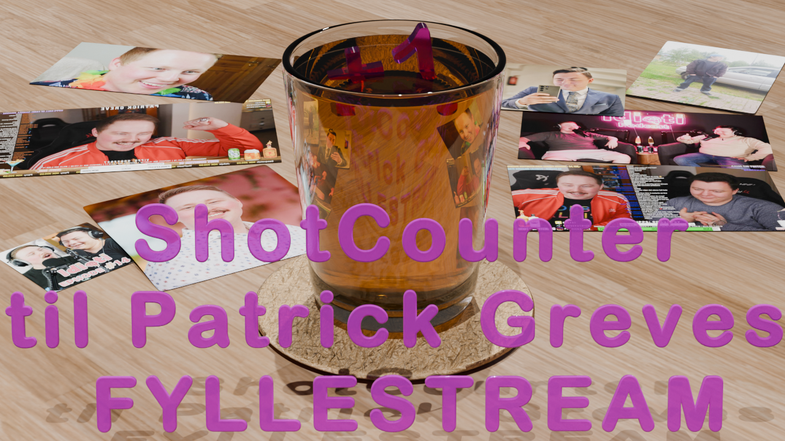
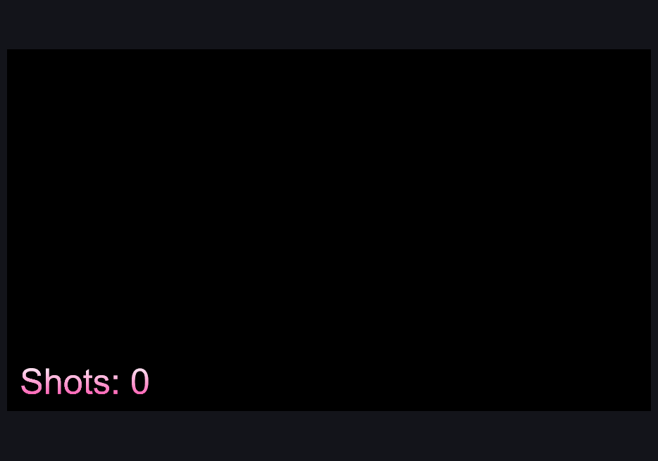
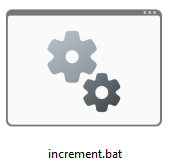
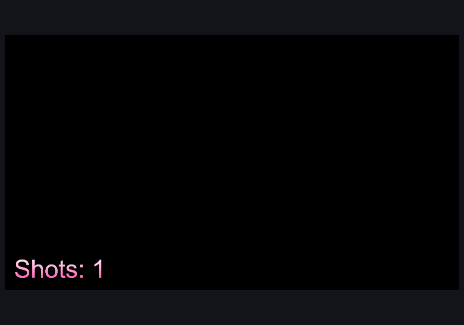
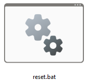

# Shotcounter til [Patrick Greves fyllestream](https://www.youtube.com/grevepatrick)


## Hva er dette
Dette er et enkelt Python-script for å holde reede på antall shots Patrick Greve har fått donert på sin fyllestream. I OBS-setup'et hans har han et tekstfelt for dette. "Problemet" er at denne må oppdateres manuelt ved å høyreklikkes på å endre tall manuelt hver gang. Ofte havner dette tallet bakpå den reelle situasjonen. Dette repositoryet løser det ved to batch-filer `increment.bat` og `reset.bat`. Ved å kjøre `increment.bat` øker tallet med ett inkrement. Batch-filen legges til som `Action` i StreamDeck, eller kjøres ved å dobbeltklikke på .bat-filen i Windows. Se bilder lenger ned.

Den har funksjon for å øke et tall i en `counter.json`-fil med ett inkrement (+1), og brukes når man får donert én shot. Da bruker man `increment.bat`-filen, som legges til som Action i StreamDeck.

For å resette counterent bruker man `reset.bat`, etter endt stream eller før neste stream.

## Kan jeg bruke dette?
Ja, men du må endre en del felter, primært mappestier, men også finne frem diverse passord og adresser i OBS. Kommentarer i selve koden er også ment for en ikke-koder, men content creator.


## Oppsett
1. Sørg for å ha installert [Python](https://www.python.org/downloads/)
2. Sørg for å ha installert [OBS Studio](https://obsproject.com/)
3. Åpne OBS Studio, gå til Verktøy → WebSocket-tjenerinnstillinger, huk av for "Enable WebSocket server"
4. Sjekk om porten din er `4455`
5. Trykk på `Vis tilkoblingsinfo`
6. Kopier `Tjenerpassord`
7. Åpne Python IDLE og åpne `ShotCounter-GrevenStream.py`. Eventuelt høyreklikk på filen og åpne i Notepad.
8. Lim inn det kopierte passordet i anførselstegnene der det står `OBS_PASSWORD = "Lim inn her"`
9. Gå til OBS Studio og opprett en ny Tekst GDI+-tekstelement i Kilder og navngi det `ShotCounter` __IKKE__ gjør noe mer, bare trykk OK.
10. Linjen `TEXT_SOURCE_NAME = "ShotCounter"` er allerede der med ShotCounter som navn. Ga du et annet navn til elementet i OBS, for eksempel `DonationCounter`, må det hete `DonationCounter` her også. Ikke fjern anførselstegnene. 

### Kjøre med pek-og-klikk
Du kan dobbeltklikke på `increment.bat` for å øke antall shot-donasjoner.
Du kan dobbeltklikke på `reset.bat` for å sette counteren tilbake til 0.

### Kjøre i terminal
`.bat`-filene inneholder bare navnet på filen, og `reset.bat`-filen navnet på filen pluss argumentet `reset`.

#### Innhold i `.bat`-filene

##### `increment.bat`
```
@echo off
C:\Python313\python.exe .\ShotCounter-GrevenStream.py
```

##### `reset.bat`
```
@echo off
C:\Python313\python.exe .\ShotCounter-GrevenStream.py reset
```

# Screenshots

  
Utgangspunktet i OpenBroadcast Software etter å ha lagt til `GDI+ tekst`-element.

  
Klikk på denne batch-filen for å øke tallet med ett inkrement 1+.  

  
Etter å ha klikket på `increment.bat` øker telleren med ett inkrement 1+.

  
For å resette counteren til 0 igjen, klikk på `reset.bat`.

